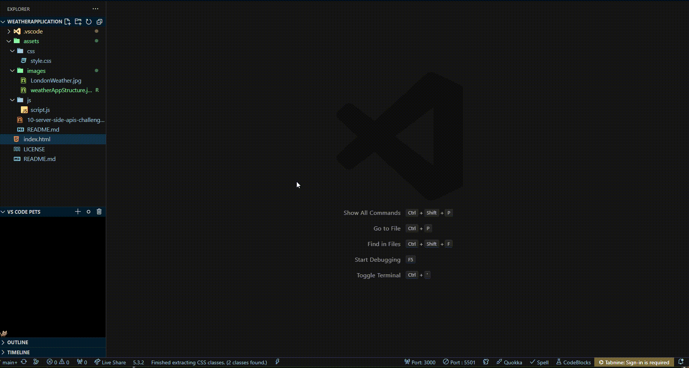

## Weather Application

The project about to reach weather temperature via application. 

## About the Project
the project shows chosen city's weather current day and following 5 days

## Screenshots

## License

[MIT](https://choosealicense.com/licenses/mit/)

## Badges

## Used By

The application used by travelers, students and to learn current weather condition the chosen city.

## Contributing

Contributions are always welcome!

